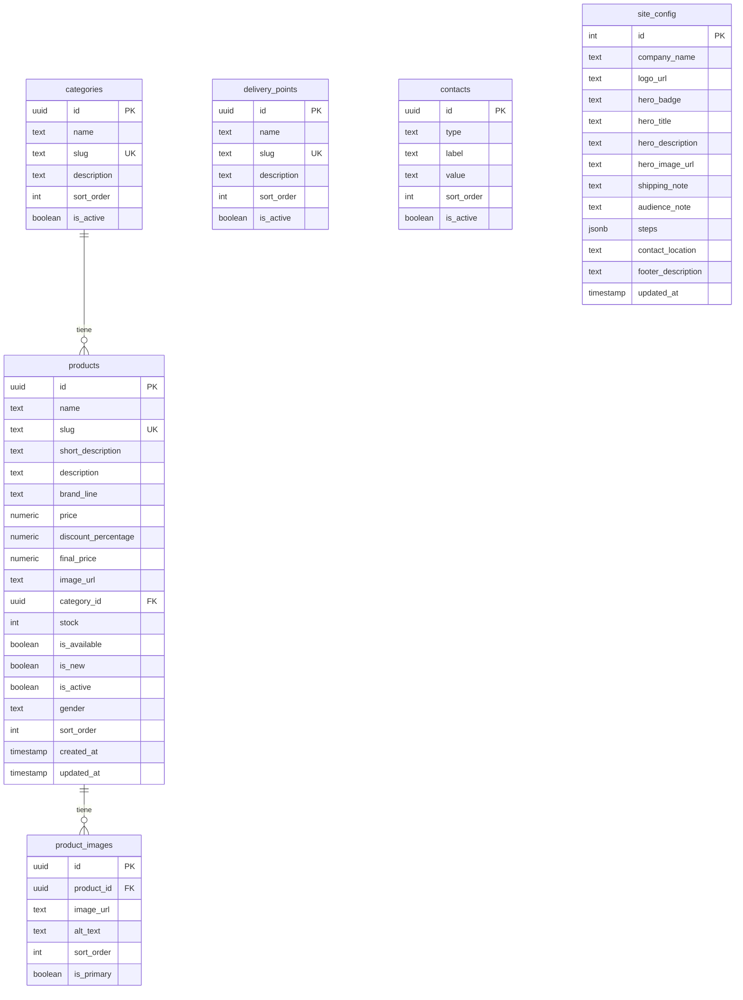

# GLOWSPOT · Catálogo Yanbal

**Distribuidor Independiente de Yanbal Bolivia**

Tienda en línea para la venta de productos **Yanbal** en Arani, Cochabamba. Los clientes exploran el catálogo, arman su carrito y confirman el pedido por **WhatsApp**, con recojo en puntos de entrega locales ("GlowSpots").

## Modelo de Negocio

- **Tipo:** E-commerce de productos de belleza y cuidado personal (skincare, maquillaje, perfumes, desodorantes) de la marca Yanbal
- **Sistema de Entrega:** Click & Collect - Pides en línea, recoges en puntos físicos estratégicos en Arani, Cochabamba. No hay envío a domicilio
- **Audiencia:** Totalmente inclusiva y unisex. Clientes de todas las edades: mujeres, hombres y niños
- **Objetivo Actual:** Rediseñar el mockup de la página web actual (que es demasiado femenino/morado) para que sea neutro, moderno y llamativo para toda la familia, sin perder la elegancia de la marca

---

## Diseño y Paleta de Colores

**Paleta: Minimalist Slate & Sun**

Un diseño profesional y moderno con una paleta de colores unisex, neutra y sofisticada.

| Uso | Color | Hex Code | Descripción |
|-----|-------|----------|-------------|
| **Primario** (Botones 'Agregar', 'Ver', Títulos) | Azul Cobalto | `#2B4C7E` | Fresco y profesional. Reemplaza todo el morado actual |
| **Fondo de Cards y Secciones Suaves** | Azul Hielo | `#EBF1F5` | Muy pálido, para fondos secundarios |
| **Acento** (Badges 'Nuevo', Ofertas, Llamativos) | Coral Caléndula | `#FF7B54` | Vibrante y llamativo |
| **Fondo General** | Blanco Puro | `#FFFFFF` | Limpio y minimalista |
| **Texto y Footer** | Gris Pizarra Profundo | `#1E2229` | Para legibilidad y elegancia |

**Estilo Visual:**
- Limpio, minimalista y de alta gama
- Totalmente inclusivo, no debe parecer una tienda de cosméticos tradicionalmente femenina
- Moderno y sofisticado para toda la familia

---

## Requisitos de Rediseño UI

### Banner Principal
- **Imagen:** Cambiar de una sola mujer a un collage moderno estilo lifestyle o foto mixta que incluya una mujer, un hombre y un niño sonriendo mientras usan productos de cuidado personal en un entorno urbano limpio
- **Texto:** "Tu belleza Yanbal, más cerca que nunca"

### Filtros de Productos
Reemplazar las categorías actuales por:
- Novedades
- Cuidado de la Piel (Unisex)
- Cuidado Masculino
- Perfumes
- Línea Niños
- Protección Solar

### Rejilla de Productos
- Los productos deben reflejar diversidad (ej. un perfume de hombre, una colonia de niños, un bloqueador solar, una crema hidratante neutra)
- Mantener precios en 'Bs.' y texto en español
- Diseño de cards limpio y moderno con la paleta de colores especificada

### Estructura de la Página
Basada en el mockup original:
- Cabecera con búsqueda
- Banner principal
- Rejilla de productos
- Mapa de puntos de entrega (GlowSpots)
- Footer

---

## Estrategia de Contenido y UX

### Botones de Filtros Rápidos (debajo del banner)

**6 botones inclusivos en orden sugerido:**

1. **Novedades GLOWSPOT** - Atrae a todos los públicos que buscan lo último
2. **Cuidado Esencial** - Término neutro que abarca skincare unisex, desodorantes, productos básicos para toda la familia
3. **Para Él** - Directo para público masculino (cuidado de barba, fragancias masculinas, cuidado facial)
4. **Para Ella** - Directo para público femenino (maquillaje, fragancias femeninas, cuidado facial)
5. **Pequeños Héroes** - Nombre creativo y cariñoso para sección infantil, más atractivo que "Niños"
6. **Protección Solar** - Categoría universalmente relevante para todas las edades y géneros

**Alternativa para rotación:** **Aromas Únicos** (enfocado en perfumería unisex)

### Redacción del Banner

**Título:** "Tu belleza Yanbal, más cerca que nunca" ✅ (mantener)

**Subtítulos (3 variantes para elegir):**

**Variante 1 (Enfoque Familia + Comodidad):**
"Descubre el cuidado ideal para toda tu familia. ¡Pide online y recoge fácil en tu GlowSpot de Arani!"

**Variante 2 (Enfoque Bienestar + Rapidez):**
"Bienestar para todos, a tu alcance. Recoge tus favoritos hoy mismo en tu GlowSpot Arani."

**Variante 3 (Enfoque Diversidad + Localidad):**
"Productos Yanbal para cada miembro de tu hogar. ¡Tu pedido listo para recoger en Arani!"

### Estructura de Categoría 'Niños' (Pequeños Héroes)

Dado que Yanbal tiene pocos productos infantiles, agrupa por momentos/beneficios para que la sección no parezca vacía:

**Opción 1: 2 Subcategorías (Más simple)**

- **Aventuras Frescas** - Colonias, shampoos suaves, productos de baño (evoca diversión y limpieza)
- **Piel Cuidada** - Protectores solares, cremas hidratantes, productos para piel delicada

**Opción 2: 3 Subcategorías (Si hay suficiente variedad)**

- **Aromas de Fantasía** - Colonias y fragancias infantiles
- **Hora del Baño Divertida** - Shampoos, jabones, productos lúdicos para el baño
- **Cuidado Diario** - Cremas, protectores solares, productos cotidianos para piel infantil

**Recomendaciones adicionales:**
- Usa imágenes de niños felices y diversos usando productos
- Enfoca descripciones en beneficios para niños (hipoalergénico, sin lágrimas) y padres (seguridad, facilidad)
- Si es posible, añade contenido educativo (consejos cuidado piel infantil) para enriquecer la sección

---

## Tabla de contenidos

- [Modelo de Negocio](#modelo-de-negocio)
- [Diseño y Paleta de Colores](#diseño-y-paleta-de-colores)
- [Requisitos de Rediseño UI](#requisitos-de-rediseño-ui)
- [Estrategia de Contenido y UX](#estrategia-de-contenido-y-ux)
- [Características](#características)
- [Stack tecnológico](#stack-tecnológico)
- [Estructura del proyecto](#estructura-del-proyecto)
- [Requisitos previos](#requisitos-previos)
- [Instalación](#instalación)
- [Variables de entorno](#variables-de-entorno)
- [Base de datos (Supabase)](#base-de-datos-supabase)
- [Scripts disponibles](#scripts-disponibles)
- [Arquitectura](#arquitectura)
- [Despliegue en Vercel](#despliegue-en-vercel)
- [Buenas prácticas del proyecto](#buenas-prácticas-del-proyecto)
- [Roadmap](#roadmap)

---

## Características

| Módulo | Descripción |
|--------|-------------|
| **Home** | Hero con imagen de fondo, filtros de categorías, presentación de la empresa y pasos de compra |
| **Catálogo** | Productos filtrados por categoría con badge de novedad y diseño responsivo |
| **Detalle de producto** | Descripción completa y galería de imágenes |
| **Puntos de entrega** | Listado de lugares de recojo en Arani |
| **Contacto** | Múltiples canales (WhatsApp, email, teléfono) |
| **Carrito** | Panel lateral con persistencia en `localStorage`, animación de producto volando al carrito |
| **Checkout** | Confirmación del pedido vía WhatsApp con precios con descuento |
| **Admin** | Panel de administración para crear/editar productos con subida de imágenes |
| **Responsive Design** | Diseño totalmente responsivo con menú hamburguesa para móvil |
| **Descuentos** | Sistema de descuentos porcentuales con precio final calculado |

---

## Stack tecnológico

| Categoría | Tecnología |
|-----------|------------|
| Framework | [Next.js 16](https://nextjs.org) (App Router) |
| Lenguaje | [TypeScript](https://www.typescriptlang.org) |
| Estilos | [Tailwind CSS 4](https://tailwindcss.com) |
| Base de datos | [Supabase](https://supabase.com) (PostgreSQL) |
| Storage | Supabase Storage |
| Cliente DB | `@supabase/supabase-js` |
| Estado del carrito | [Zustand](https://zustand.docs.pmnd.rs) + persistencia |
| Íconos | [Lucide React](https://lucide.dev) |
| Deploy | [Vercel](https://vercel.com) |

---

## Estructura del proyecto

```
emprendimiento-xd/
├── app/
│   ├── layout.tsx              # Layout raíz con fuentes globales
│   ├── page.tsx                # Home con Hero, productos y secciones
│   ├── globals.css             # Estilos globales
│   ├── admin/
│   │   └── products/
│   │       └── page.tsx        # Panel de administración de productos
│   └── carrito/
│       └── page.tsx            # Página del carrito
├── components/
│   ├── Navbar.tsx              # Barra de navegación responsiva con menú hamburguesa
│   ├── Hero.tsx                # Sección hero con imagen de fondo
│   ├── ProductCard.tsx         # Tarjeta de producto con animación al carrito
│   ├── CategoryFilter.tsx      # Filtro por categoría
│   ├── CartSidebar.tsx         # Panel lateral del carrito
│   ├── HowItWorks.tsx          # Sección de cómo funciona
│   ├── Footer.tsx              # Pie de página
│   └── admin/
│       ├── ProductList.tsx     # Lista de productos en admin
│       └── ProductForm.tsx     # Formulario para crear/editar productos
├── lib/
│   ├── supabase/
│   │   ├── client.ts           # Cliente Supabase
│   │   └── queries.ts          # Consultas a la BD
│   ├── whatsapp.ts             # Generación de mensajes WhatsApp
│   ├── utils.ts                # Utilidades (formato de precio, etc.)
│   └── utils/
│       └── imageCompression.ts # Compresión y subida de imágenes
├── store/
│   └── cartStore.ts            # Estado global del carrito con persistencia
├── types/
│   └── index.ts                # Tipos TypeScript (Product, Category, etc.)
├── supabase/
│   ├── schema.sql              # Estructura de tablas
│   ├── seed.sql                # Datos de ejemplo
│   └── migrations/             # Migraciones de base de datos
├── public/
│   └── imagenes/               # Imágenes estáticas
├── .env.local.example          # Plantilla de variables de entorno
└── package.json
```

---

## Requisitos previos

- [Node.js](https://nodejs.org) 20 o superior
- [npm](https://www.npmjs.com) 10 o superior
- Cuenta en [Supabase](https://supabase.com)
- Cuenta en [Vercel](https://vercel.com) (para deploy)
- Cuenta en [GitHub](https://github.com) (control de versiones)

---

## Instalación

```bash
# 1. Clonar el repositorio
git clone https://github.com/tu-usuario/emprendimiento-xd.git
cd emprendimiento-xd/emprendimiento-xd

# 2. Instalar dependencias
npm install

# 3. Configurar variables de entorno
cp .env.local.example .env.local
# Editar .env.local con tus credenciales

# 4. Iniciar servidor de desarrollo
npm run dev
```

Abre [http://localhost:3000](http://localhost:3000) en tu navegador.

> **Nota:** Ejecuta `npm run dev` siempre desde la carpeta `emprendimiento-xd/`, no desde la raíz del repositorio.

---

## Variables de entorno

Copia `.env.local.example` a `.env.local` y completa los valores:

```env
# Supabase
NEXT_PUBLIC_SUPABASE_URL=https://tu-proyecto.supabase.co
NEXT_PUBLIC_SUPABASE_ANON_KEY=tu-anon-key

# WhatsApp (código de país + número, sin + ni espacios)
NEXT_PUBLIC_WHATSAPP_NUMBER=59174307669
```

| Variable | Descripción |
|----------|-------------|
| `NEXT_PUBLIC_SUPABASE_URL` | URL del proyecto en Supabase |
| `NEXT_PUBLIC_SUPABASE_ANON_KEY` | Clave pública (anon/publishable) de Supabase |
| `NEXT_PUBLIC_WHATSAPP_NUMBER` | Número de WhatsApp para confirmar pedidos |

> **Importante:** Nunca subas `.env.local` a Git. Ya está incluido en `.gitignore`.

---

## Base de datos (Supabase)

### Tablas



| Tabla | Propósito |
|-------|-----------|
| `categories` | Tipos de producto (Cuidado de la Piel, Perfumes, etc.) |
| `products` | Catálogo completo con precios, descuentos, stock, género y disponibilidad |
| `product_images` | Galería de imágenes por producto (múltiples imágenes) |
| `delivery_points` | Puntos de recojo en Arani con descripciones |
| `contacts` | Canales de contacto (WhatsApp, email, teléfono, otros) |
| `site_config` | Configuración global: logo, hero, pasos de compra, notas, footer |

### Campos importantes de la tabla products

| Campo | Tipo | Descripción |
|-------|------|-------------|
| `id` | UUID | Identificador único del producto |
| `name` | text | Nombre del producto |
| `slug` | text | URL amigable (ej: "serum-facial-renovador") |
| `price` | numeric | Precio original en Bolivianos |
| `discount_percentage` | numeric | Porcentaje de descuento (0-100) |
| `final_price` | numeric | Precio final después de descuento (calculado) |
| `image_url` | text | URL de la imagen principal |
| `category_id` | UUID | ID de la categoría (FK) |
| `stock` | integer | Cantidad disponible en inventario |
| `is_available` | boolean | Disponible para venta |
| `is_new` | boolean | Muestra badge "Nuevo" |
| `is_active` | boolean | Activo en el catálogo |
| `gender` | text | Género: 'unisex', 'men', 'women', 'kids' |
| `sort_order` | integer | Orden de visualización |
| `created_at` | timestamp | Fecha de creación |
| `updated_at` | timestamp | Fecha de última actualización |

### Configuración inicial

1. Entra a tu proyecto en [Supabase Dashboard](https://supabase.com/dashboard).
2. Ve a **SQL Editor** → **New query**.
3. Ejecuta el contenido de `supabase/schema.sql`.
4. Ejecuta el contenido de `supabase/seed.sql`.

### Storage (imágenes de productos)

1. Ve a **Storage** → **New bucket**.
2. Nombre: `products`.
3. Marca **Public bucket** → **Create bucket**.
4. Sube las imágenes y guarda la URL pública en `products.image_url` o `product_images.image_url`.

---

## Scripts disponibles

```bash
npm run dev      # Servidor de desarrollo (http://localhost:3000)
npm run build    # Compilar para producción
npm run start    # Servidor de producción
npm run lint     # Verificar código con ESLint
```

---

## Arquitectura

```
┌─────────────────────────────────────────────────────┐
│                     Cliente (Browser)                │
│  ┌──────────┐  ┌────────────┐  ┌────────────────┐  │
│  │  Next.js │  │  Zustand   │  │  localStorage  │  │
│  │  App     │  │  (carrito) │  │  (persistencia)│  │
│  └────┬─────┘  └────────────┘  └────────────────┘  │
│       │                                              │
│       ▼                                              │
│  ┌──────────────────────────────────────────────┐   │
│  │           Supabase Client (queries.ts)        │   │
│  └──────────────────┬───────────────────────────┘   │
└─────────────────────┼───────────────────────────────┘
                      │
          ┌───────────┴───────────┐
          ▼                       ▼
   ┌─────────────┐        ┌──────────────┐
   │  PostgreSQL │        │   Storage    │
   │  (tablas)   │        │  (imágenes)  │
   └─────────────┘        └──────────────┘
```

**Flujo de compra:**

1. El usuario navega el catálogo y agrega productos al carrito.
2. El carrito se guarda en `localStorage` vía Zustand.
3. Al confirmar, se genera un mensaje de WhatsApp con el resumen del pedido.
4. El vendedor coordina el punto y horario de recojo.

---

## Despliegue en Vercel

1. Sube el repositorio a GitHub.
2. Entra a [vercel.com/new](https://vercel.com/new) e importa el repo.
3. Configura el **Root Directory** como `emprendimiento-xd`.
4. Agrega las variables de entorno en **Settings → Environment Variables**:
   - `NEXT_PUBLIC_SUPABASE_URL`
   - `NEXT_PUBLIC_SUPABASE_ANON_KEY`
   - `NEXT_PUBLIC_WHATSAPP_NUMBER`
5. Haz clic en **Deploy**.

---

## Buenas prácticas del proyecto

### Código

- Usar **TypeScript** estricto; los tipos viven en `types/index.ts`.
- Las consultas a Supabase van en `lib/supabase/queries.ts`, no directamente en componentes.
- Componentes reutilizables en `components/`, páginas en `app/`.
- Prefijo `@/` para imports absolutos (configurado en `tsconfig.json`).

### Base de datos

- Cambios de esquema siempre en `supabase/schema.sql`.
- Datos de prueba en `supabase/seed.sql`.
- Row Level Security (RLS) habilitado: solo lectura pública.
- Usar `slug` en URLs amigables (`/producto/serum-facial-renovador`).

### Seguridad

- Nunca commitear `.env.local` ni claves secretas.
- Solo usar la clave `anon`/`publishable` en el frontend.
- La clave `service_role` solo en backend/server-side (si se necesita en el futuro).

### Git

- Commits descriptivos en español o inglés, pero consistentes.
- Una rama por feature (`feat/home`, `feat/carrito`, etc.).
- Pull Request antes de merge a `main`.

---

## Roadmap

- [x] Estructura del proyecto
- [x] Conexión con Supabase
- [x] Diseño de base de datos
- [x] Store del carrito (Zustand)
- [x] Interfaz del Home (hero, buscador, secciones)
- [x] Catálogo de productos con filtros
- [x] Panel lateral del carrito
- [x] Integración WhatsApp para checkout
- [x] Sistema de descuentos porcentuales
- [x] Panel de administración de productos
- [x] Subida y compresión de imágenes
- [x] Diseño responsivo (móvil y desktop)
- [x] Animación de producto volando al carrito
- [ ] Página de detalle de producto
- [ ] Deploy en Vercel

---

## Licencia

Proyecto privado. Todos los derechos reservados.

---

<p align="center">
  Hecho con ❤️ en Arani, Cochabamba · Bolivia
</p>
