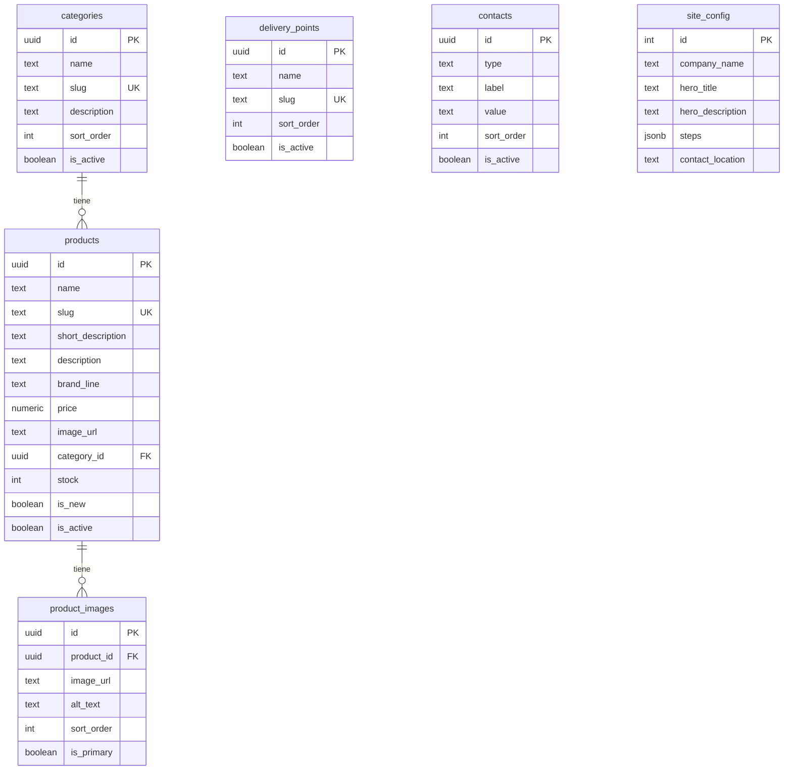

# GLOWSPOT · Catálogo Yanbal

Tienda en línea para la venta de productos **Yanbal** en Arani, Cochabamba. Los clientes exploran el catálogo, arman su carrito y confirman el pedido por **WhatsApp**, con recojo en puntos de entrega locales.

---

## Tabla de contenidos

- [Características](#características)
- [Stack tecnológico](#stack-tecnológico)
- [Estructura del proyecto](#estructura-del-proyecto)
- [Requisitos previos](#requisitos-previos)
- [Instalación](#instalación)
- [Variables de entorno](#variables-de-entorno)
- [Base de datos (Supabase)](#base-de-datos-supabase)
- [Scripts disponibles](#scripts-disponibles)
- [Arquitectura](#arquitectura)
- [Despliegue en Vercel](#despliegue-en-vercel)
- [Buenas prácticas del proyecto](#buenas-prácticas-del-proyecto)
- [Roadmap](#roadmap)

---

## Características

| Módulo | Descripción |
|--------|-------------|
| **Home** | Hero, buscador, presentación de la empresa y pasos de compra |
| **Catálogo** | Productos filtrados por categoría con badge de novedad |
| **Detalle de producto** | Descripción completa y galería de imágenes |
| **Puntos de entrega** | Listado de lugares de recojo en Arani |
| **Contacto** | Múltiples canales (WhatsApp, email, teléfono) |
| **Carrito** | Panel lateral con persistencia en `localStorage` |
| **Checkout** | Confirmación del pedido vía WhatsApp |

---

## Stack tecnológico

| Categoría | Tecnología |
|-----------|------------|
| Framework | [Next.js 16](https://nextjs.org) (App Router) |
| Lenguaje | [TypeScript](https://www.typescriptlang.org) |
| Estilos | [Tailwind CSS 4](https://tailwindcss.com) |
| Base de datos | [Supabase](https://supabase.com) (PostgreSQL) |
| Storage | Supabase Storage |
| Cliente DB | `@supabase/supabase-js` |
| Estado del carrito | [Zustand](https://zustand.docs.pmnd.rs) + persistencia |
| Íconos | [Lucide React](https://lucide.dev) |
| Deploy | [Vercel](https://vercel.com) |

---

## Estructura del proyecto

```
emprendimiento-xd/
├── app/
│   ├── layout.tsx              # Layout raíz
│   ├── page.tsx                # Home
│   ├── globals.css             # Estilos globales
│   └── carrito/
│       └── page.tsx            # Página del carrito
├── components/
│   ├── Navbar.tsx              # Barra de navegación
│   ├── ProductCard.tsx         # Tarjeta de producto
│   └── CategoryFilter.tsx      # Filtro por categoría
├── lib/
│   ├── supabase/
│   │   ├── client.ts           # Cliente Supabase
│   │   └── queries.ts          # Consultas a la BD
│   ├── whatsapp.ts             # Generación de mensajes WhatsApp
│   └── utils.ts                # Utilidades (formato de precio, etc.)
├── store/
│   └── cartStore.ts            # Estado global del carrito
├── types/
│   └── index.ts                # Tipos TypeScript
├── supabase/
│   ├── schema.sql              # Estructura de tablas
│   └── seed.sql                # Datos de ejemplo
├── .env.local.example          # Plantilla de variables de entorno
└── package.json
```

---

## Requisitos previos

- [Node.js](https://nodejs.org) 20 o superior
- [npm](https://www.npmjs.com) 10 o superior
- Cuenta en [Supabase](https://supabase.com)
- Cuenta en [Vercel](https://vercel.com) (para deploy)
- Cuenta en [GitHub](https://github.com) (control de versiones)

---

## Instalación

```bash
# 1. Clonar el repositorio
git clone https://github.com/tu-usuario/emprendimiento-xd.git
cd emprendimiento-xd/emprendimiento-xd

# 2. Instalar dependencias
npm install

# 3. Configurar variables de entorno
cp .env.local.example .env.local
# Editar .env.local con tus credenciales

# 4. Iniciar servidor de desarrollo
npm run dev
```

Abre [http://localhost:3000](http://localhost:3000) en tu navegador.

> **Nota:** Ejecuta `npm run dev` siempre desde la carpeta `emprendimiento-xd/`, no desde la raíz del repositorio.

---

## Variables de entorno

Copia `.env.local.example` a `.env.local` y completa los valores:

```env
# Supabase
NEXT_PUBLIC_SUPABASE_URL=https://tu-proyecto.supabase.co
NEXT_PUBLIC_SUPABASE_ANON_KEY=tu-anon-key

# WhatsApp (código de país + número, sin + ni espacios)
NEXT_PUBLIC_WHATSAPP_NUMBER=59174307669
```

| Variable | Descripción |
|----------|-------------|
| `NEXT_PUBLIC_SUPABASE_URL` | URL del proyecto en Supabase |
| `NEXT_PUBLIC_SUPABASE_ANON_KEY` | Clave pública (anon/publishable) de Supabase |
| `NEXT_PUBLIC_WHATSAPP_NUMBER` | Número de WhatsApp para confirmar pedidos |

> **Importante:** Nunca subas `.env.local` a Git. Ya está incluido en `.gitignore`.

---

## Base de datos (Supabase)

### Tablas



| Tabla | Propósito |
|-------|-----------|
| `categories` | Tipos de producto (Cuidado de la Piel, Perfumes, etc.) |
| `products` | Catálogo con descripción corta y completa |
| `product_images` | Galería de imágenes por producto |
| `delivery_points` | Puntos de recojo en Arani |
| `contacts` | Canales de contacto (WhatsApp, email, teléfono) |
| `site_config` | Contenido del home, footer y configuración general |

### Configuración inicial

1. Entra a tu proyecto en [Supabase Dashboard](https://supabase.com/dashboard).
2. Ve a **SQL Editor** → **New query**.
3. Ejecuta el contenido de `supabase/schema.sql`.
4. Ejecuta el contenido de `supabase/seed.sql`.

### Storage (imágenes de productos)

1. Ve a **Storage** → **New bucket**.
2. Nombre: `products`.
3. Marca **Public bucket** → **Create bucket**.
4. Sube las imágenes y guarda la URL pública en `products.image_url` o `product_images.image_url`.

---

## Scripts disponibles

```bash
npm run dev      # Servidor de desarrollo (http://localhost:3000)
npm run build    # Compilar para producción
npm run start    # Servidor de producción
npm run lint     # Verificar código con ESLint
```

---

## Arquitectura

```
┌─────────────────────────────────────────────────────┐
│                     Cliente (Browser)                │
│  ┌──────────┐  ┌────────────┐  ┌────────────────┐  │
│  │  Next.js │  │  Zustand   │  │  localStorage  │  │
│  │  App     │  │  (carrito) │  │  (persistencia)│  │
│  └────┬─────┘  └────────────┘  └────────────────┘  │
│       │                                              │
│       ▼                                              │
│  ┌──────────────────────────────────────────────┐   │
│  │           Supabase Client (queries.ts)        │   │
│  └──────────────────┬───────────────────────────┘   │
└─────────────────────┼───────────────────────────────┘
                      │
          ┌───────────┴───────────┐
          ▼                       ▼
   ┌─────────────┐        ┌──────────────┐
   │  PostgreSQL │        │   Storage    │
   │  (tablas)   │        │  (imágenes)  │
   └─────────────┘        └──────────────┘
```

**Flujo de compra:**

1. El usuario navega el catálogo y agrega productos al carrito.
2. El carrito se guarda en `localStorage` vía Zustand.
3. Al confirmar, se genera un mensaje de WhatsApp con el resumen del pedido.
4. El vendedor coordina el punto y horario de recojo.

---

## Despliegue en Vercel

1. Sube el repositorio a GitHub.
2. Entra a [vercel.com/new](https://vercel.com/new) e importa el repo.
3. Configura el **Root Directory** como `emprendimiento-xd`.
4. Agrega las variables de entorno en **Settings → Environment Variables**:
   - `NEXT_PUBLIC_SUPABASE_URL`
   - `NEXT_PUBLIC_SUPABASE_ANON_KEY`
   - `NEXT_PUBLIC_WHATSAPP_NUMBER`
5. Haz clic en **Deploy**.

---

## Buenas prácticas del proyecto

### Código

- Usar **TypeScript** estricto; los tipos viven en `types/index.ts`.
- Las consultas a Supabase van en `lib/supabase/queries.ts`, no directamente en componentes.
- Componentes reutilizables en `components/`, páginas en `app/`.
- Prefijo `@/` para imports absolutos (configurado en `tsconfig.json`).

### Base de datos

- Cambios de esquema siempre en `supabase/schema.sql`.
- Datos de prueba en `supabase/seed.sql`.
- Row Level Security (RLS) habilitado: solo lectura pública.
- Usar `slug` en URLs amigables (`/producto/serum-facial-renovador`).

### Seguridad

- Nunca commitear `.env.local` ni claves secretas.
- Solo usar la clave `anon`/`publishable` en el frontend.
- La clave `service_role` solo en backend/server-side (si se necesita en el futuro).

### Git

- Commits descriptivos en español o inglés, pero consistentes.
- Una rama por feature (`feat/home`, `feat/carrito`, etc.).
- Pull Request antes de merge a `main`.

---

## Roadmap

- [x] Estructura del proyecto
- [x] Conexión con Supabase
- [x] Diseño de base de datos
- [x] Store del carrito (Zustand)
- [ ] Interfaz del Home (hero, buscador, secciones)
- [ ] Catálogo de productos con filtros
- [ ] Página de detalle de producto
- [ ] Panel lateral del carrito
- [ ] Integración WhatsApp para checkout
- [ ] Deploy en Vercel

---

## Licencia

Proyecto privado. Todos los derechos reservados.

---

<p align="center">
  Hecho con ❤️ en Arani, Cochabamba · Bolivia
</p>
